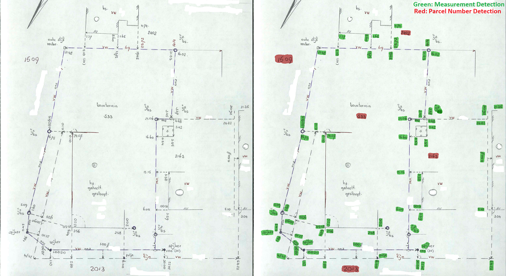

# Textbox Instance Segmentation using Mask-RCNN

An end-to-end system which is able to detect textboxes in images. The Neural Network is a FCNN variant (Mask-RCNN).
This repository is intended to detect measurements and parcel numbers in field sketches. Mask prediction example using trained model:

Training can be started from train/train.ipynb (For example on Google Colab).
